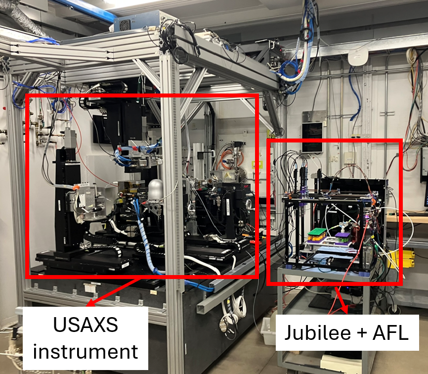

# Automated Mesoporous Synthesis

This repository is a companion to the paper, "Open-hardware automation platform for accelerated sol-gel nanomaterial synthesis". It contains the execution code used to run the automated synthesis experiments as well as a tutorial walk-through detailing how to reproduce the synthesis workflow.



## Repository contents
```
synthesis_experiment_files/
├── fully_automated_execution/                      # Fully automated synthesis–characterization experiments
│   ├── 2025_03_28_BaselineSampling.ipynb           # Uses NIST-AFL sample loader
│   ├── Sobol_baseline_sample_generation.ipynb      # Constrained Sobol sampling
│   ├── Mesoporous_SobolBaseline_APS_*.csv          # Sample compositions
│   ├── 2025_03_28_BaselineSampling.log             # Experiment log file
│   ├── Mesoporous_constants_APS.json               # Parameter space constants
│   └── systemconfig.json                           # AFL and system config
│
├── batch_synthesis/                                # Batch-mode synthesis (main paper experiments)
│   ├── 2025_03_29_BatchSynthesis.ipynb
│   ├── Sobol_baseline_sample_generation_batchmode.ipynb
│   ├── Mesoporous_SobolBaseline_APS_BatchMode_*.csv
│   ├── Mesoporous_constants_APS_batch.json
│   ├── APS_batchSynthesis_2025_03_29.log
│   └── systemconfig.json
│
├── tutorial/                                       # Instructional walkthrough
│   ├── tutorial.md
│   └── TutorialWalkthrough.ipynb
│
├── usaxs_integration/                              # Automated USAXS integration
│   ├── usaxs_integration.md
│   └── beamline_control_script.py
│
├── sample_utilities/                               # Sample selection + volume calculations
│   └── samples.py
│
├── scattering_data
│   ├── SAXS_reduced_data
│   ├── usaxs_raw_data
│   └── usaxs_reduced_data
|
├── stober_synthesis_utils.py                       # Reactant transfer and mixing utilities
├── usaxs_utils.py                                  # USAXS instrument client integration
└── sample_composition_information                  # Sample reference including composition and associated scattering filenames


```
  ## Procedure tutorial

  For an explanatory walk-through of the steps needed to set up and execute the synthesis described in the paper, check out the [tutorial](Tutorial/tutorial.md)

  ## Instrument integration

  More information on the APS 12-ID-E USAXS and Xenocs SAXS instrument integrations is available [here](usaxs_integration/usaxs_integration.md).

  ## Included scattering data
  Collected scattering data for the batch parameter space exploration synthesis experiment are included in `scattering_data`
  - SAXS_reduced_data contains data collected on a Xenocs Xeuss 3.0, with high resolution in the high-q region corresponding to scattering from the porous interior of particles. This data has been reduced as described in the manuscript.
  - usaxs_raw_data contains non-reduced USAXS data in .h5 file format. The files are named in format {Cartridge plate well}_{scan number}_{Instrument incremental ID}.h5. Refer to the sample composition information file to determine which scattering data goes with which sample. 
  - usaxs_reduced data contains the reduced usaxs data. The nonreduced usaxs data can be reduced using Igor Pro 8.04. The appropriate empty container background is `A2_1_2035.h5` for samples with instrument ID below 2081 and `A3_0_c2_2108.h5` for samples with instrument ID  of 2109 and above. 

  ## Additional hardware documentation

  The science-jubilee platform, including the Digital Pipette syringe tools, is fully documented [here](https://science-jubilee.readthedocs.io/en/latest/)

  The NIST-AFL sample changer implementation is documented [here](https://github.com/pozzo-research-group/AFL-sample-loader/tree/main).