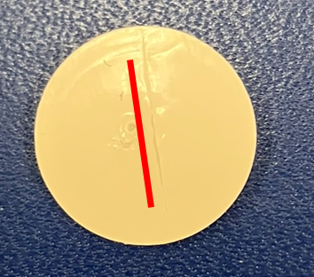
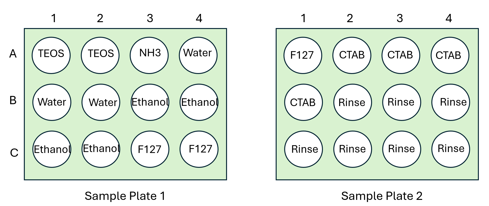

# Tutorial Walkthrough

This walkthrough provides guidance for reproducing the synthesis and characterization processes reported in this work. 

## Prerequisites
This walkthrough assumes that you have:
- A [science-jubilee](https://science-jubilee.readthedocs.io/en/latest/index.html) configured with 5 [Digital Pipette syringe tools](https://science-jubilee.readthedocs.io/en/latest/building/http_syringe.html) and an [AFL lab automation deck mask](https://github.com/machineagency/science-jubilee/blob/main/tool_library/bed_plate/fabrication_files/AFL_deck_plate.svg), and familiarity with the basics of working with this equipment. You need the following syringe tool configurations. See the Digital pipette tool docs for more information on these:
        - 1x 10cc plastic disposable
        - 2x 1cc Hamilton glass 
        - 2x 1cc plastic disposable
- A built and functional implementation of our NIST-AFL sample changer implementation [documented here](https://github.com/pozzo-research-group/AFL-sample-loader), set up, tuned, and reliably loading samples into a flow cell that is mounted in your instrument.
- Access to an X-ray scattering instrument, with the capability to remotely trigger measurements and be notified when they are completed. 
- All equipment is set up and accessible over a local network (at least for your Jubilee, AFL, and digital syringe tools). 
- This repository cloned onto a control computer running a reasonable version of python, with the [science-jubilee library](https://github.com/machineagency/science-jubilee) installed in your environment. 

> ⚠️ **Hazards**  
> TEOS is acutely toxic, TEOS and ethanol are flammable, and ammonium hydroxide is corrosive (and smells awful). Take steps to prevent exposure to vapors. The silicone septa used here do an effective job of limiting vapor generation, enough so that we are able to run this synthesis outside of a fume hood in a poorly ventilated instrument hutch without getting a whiff of anything. However, we thoroughly vetted our synthesis in a fume hood where spilled reactants would not have causes a safety problem first. 

## Required materials

### Reactants:
- Tetraethyl orthosilicate, reagent grade. 
- Anhydrous ethanol
- Aqueous ammonium hydroxide solution
- Cetyltrimethylammonium bromide (CTAB)
- Pluronic F127
- Access to ultrapure (milliQ) water

### Consumables and labware
- 20cc scintillation vials with 22-400 threaded caps, such as https://www.fishersci.com/shop/products/wheaton-glass-20ml-scintillation-vials-urea-caps-5/0334125H#?keyword=0334125H
- Septa caps for 22-400 threads (https://chemglass.com/gpi-22-400-screw-thread-closures)
- 22mm silicone septa, such as https://chemglass.com/gpi-22-400-septa-for-screw-thread-closures-septum
- 20G x 2inch blunt tip luer-lock syringe tips, such as https://www.amazon.com/gp/product/B0D54JYHJW?smid=AF9CPILHGHOMP&th=1
- disposable 1cc syringes compatible with your syringe tools.
- disposable 10cc syringes compatible with your 10cc syringe tools
- 20cc vial well plates (3D print with PLA). 3 minimum needed for experiment.
        - Well plate: https://github.com/pozzo-research-group/Automation-Hardware/blob/master/Vial%20Holders/20mLscintillation_12_wellplate_withRetainer/20cc_vial_plate%20v5.stl
        - Retainer lid: https://github.com/pozzo-research-group/Automation-Hardware/blob/master/Vial%20Holders/20mLscintillation_12_wellplate_withRetainer/20cc_vial_plate_retainerlid%20v2.stl
        - M3 heat set inserts: https://www.mcmaster.com/94180A331/. Install these into the four holes on top of the well plate. 
        - Long M3 screws, M3x60mm.

### Lab equipment
- Volumetric measuring tools like graduated cylinders
- Analytical balance
- Fume hood
- Heated stir plate

## Material Preparation

### Prepare stock solutions
1. Dilute TEOS in ethanol. This is done to increase the delivery volume for a given amount of TEOS, improving dispense precision. Dilute TEOS in anhydrous ethanol at a ratio of 1 part TEOS to 1.85 parts ethanol by unmixed volume. This works out to 35 mL of TEOS mixed with 65 mL of ethanol.
2. Dissolve solid CTAB and Pluronic F127 (separately) in water, at a concentration of 15 g CTAB per L of water, and 50 g F127 per liter of water. Suggested volume: 100 mL. You will likely need to lightly heat the CTAB to get it to dissolve. 

### Prepare labware
1. Pre-slit the septa. Using a sharp x-acto knife, slit each septa across the center, as shown. Leave the edges intact.

2. Prepare sample vials: Prepare a well plate of 12 scintillation vials, capped with the slit septa and a septa threaded cap. The septa should be shiny side up. Place a retaining lid over the top of the vials, with the recessed lip facing down, and thread the assembly together through the top of the retaining lid into the heat set inserts in the well plate. 
3. Prepare stock solution vials: Fill vials with the required solutions or reactants, and cap them as described above in (2). Label the vials. The rinse solutions are just the same anhydrous ethanol.

| Reactant or solution | Number of vials |
| --- | --- |
| TEOS:Ethanol 1:1.85 | 2 |
| Ammonium hydroxide, aqueous, ~29% | 1|
| Ultrapure water | 3 |
| Anhydrous ethanol | 4 |
| Pluronic F127 solution | 3 |
| CTAB solution | 4 |
| Pre-TEOS rinse | 3 |
| Post-TEOS rinse | 4 |

4. Load the vials into the labware in the pattern shown below.

5. Screw the lids on as was done for the sample vials. 

## Jubilee and NIST-AFL preparation
1. Make sure the NIST-AFL rinse bottles are filled. We use water in rinse 1 and a water/ethanol mixture (~70/30) in rinse 2.
2. Make sure the Jubilee deck is clear. IF you have installed the NIST-AFL catch module, remove it.
3. Install a new mix syringe and syringe tip. The rubber plunger in the syringe will swell after contact with TEOS, so needs to be replaced every few hours. After replacing the syringe, re-set the tool offsets (refresher in the [Jubilee documentation](https://science-jubilee.readthedocs.io/en/latest/getting_started/new_user_guide.html#setting-tool-parking-post-positions-and-offsets))
4. Power up the Jubilee and AFL, and pressurize the NIST-AFL system.
5. Home the Jubilee.
6. The rest of this walk-through is described in the tutorial walk-through notebook. 

