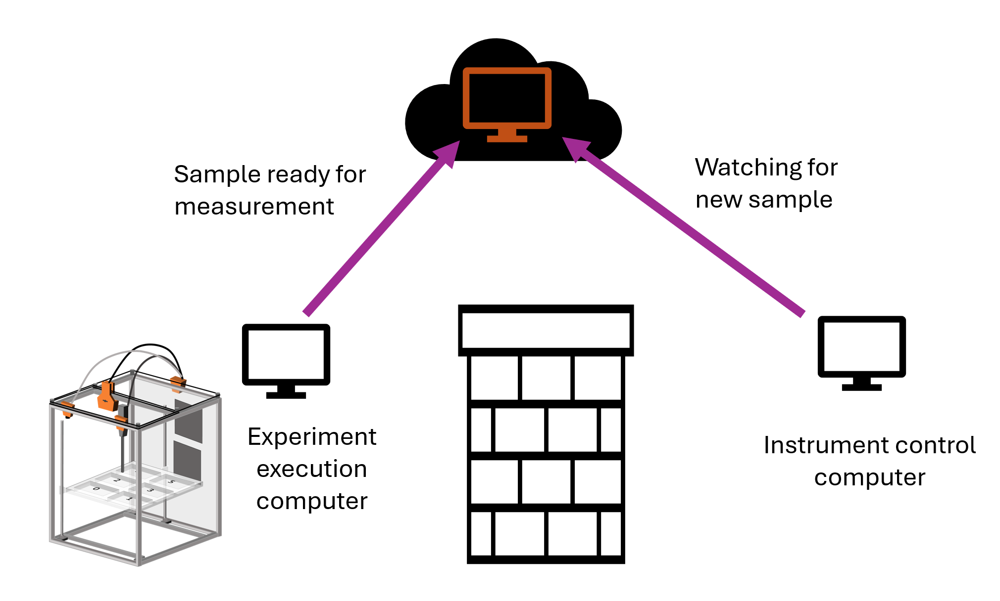

# APS 12-ID-E USAXS integration 

To enable fully automated sample measurements, we developed an integration with the 12-ID-E USAXS beamline control software to allow for the remote triggering of measurements and communication back to the experiment after experiments were finished. Due to Argonne network security restrictions, we could not directly connect to the instrument control computer over the network. To communicate, we used a text file stored on a cloud instance as a message queue. When a sample was loaded and ready for measurement, the experiment control computer would use scp to update a message file stored on the cloud instance with the timestamp and sample UUID. A watcher script running on the instrument control computer monitored the message file for timestamp updates. When an update was detected, the script triggered a measurement sequence using the AFL USAXS instrument driver interface. After the measurement completed, a prototype automated data reduction pipeline reduced the USAXS flyscan data, then the script uploaded it to another cloud instance. A watcher thread running on the experiment control computer monitored the cloud instance for the data file for the current sample, and used it's presence as a trigger for the AFL rinse cycle. The measurement completion monitoring integrated the 'check_sample_status' endpoint of a never-quite-completed USAXS experiment [data server app](https://github.com/brendenpelkie/usaxs_processing). I would suggest just starting from scratch to implement some basic file watching system rather than getting this up and running.

The experiment control computer side of this interface is in the [usaxs_utils.py](../usaxs_utils.py) file. The script running on the beamline control computer is [[./beamline_control_script.py]]. Note that due to ever-tightening security controls, as of May 2025 the USAXS control computer is no longer able to reach the external internet, which means that this interface no longer works. Future users interested in automating measurement triggering will need to plan well in advance to get their computers onto the APS network. 

## Xenocs Xeuss integration

We have also worked on developing an integration for our laboratory Xenocs instrument. This interface will work by triggering a SPEC macro through the instrument's SPEC server interface. A proof of concept of this integration is [here](https://github.com/pozzo-research-group/saxs_data_processing/blob/main/minimum_remote_spec_example.ipynb). Work is currently in progress on extending this POC into a working integration.